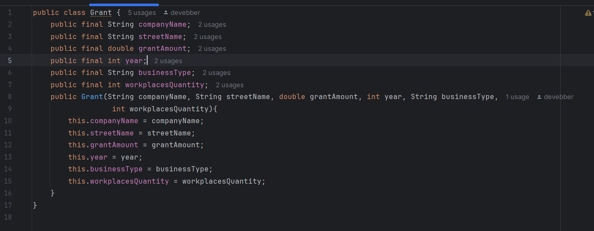
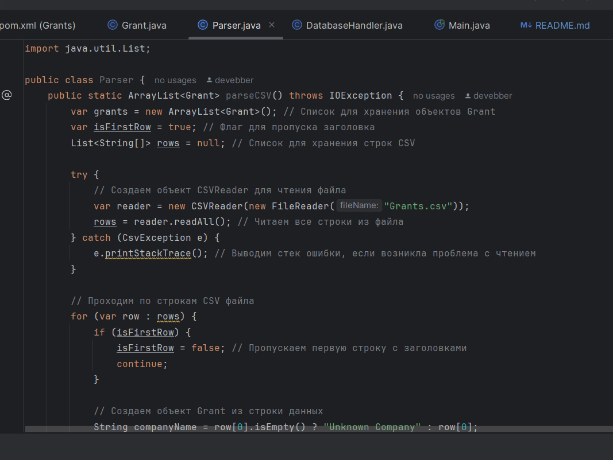
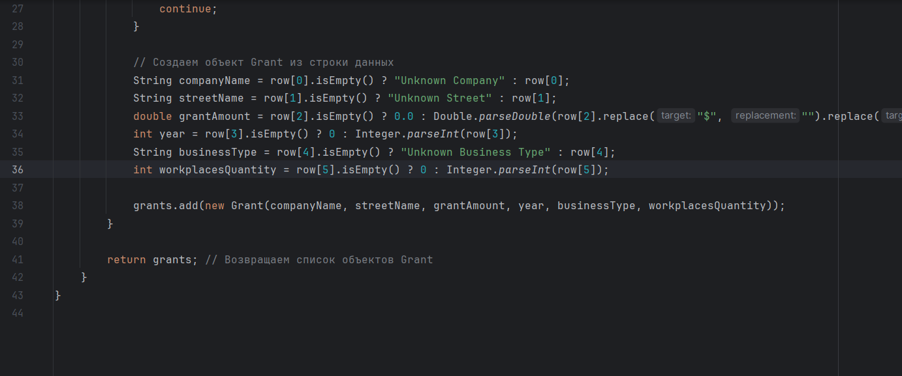
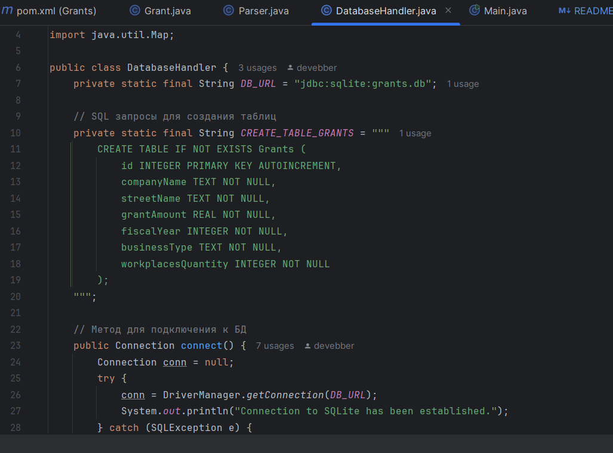
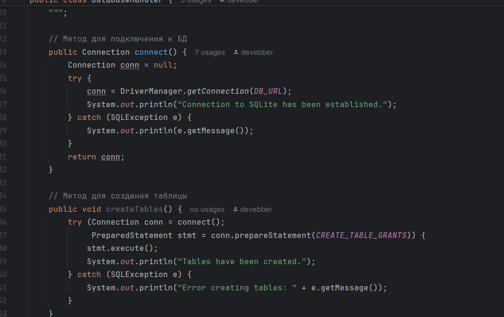
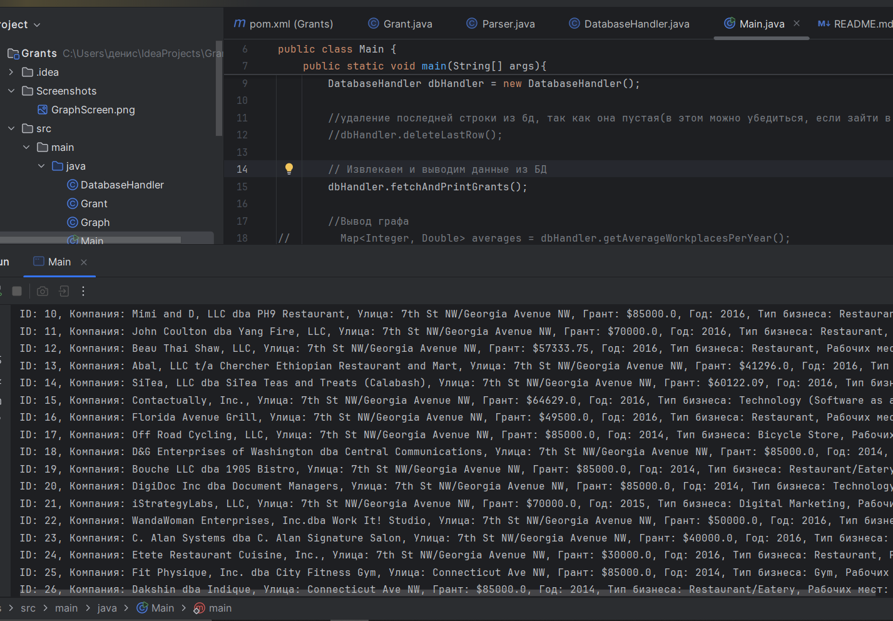
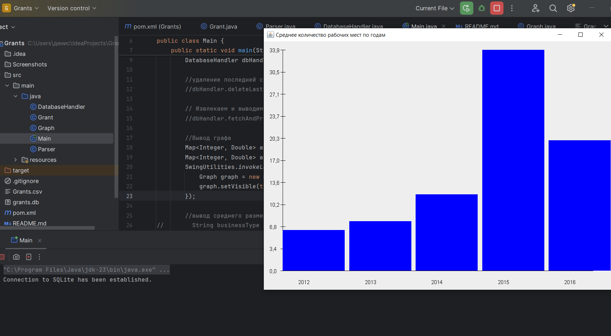
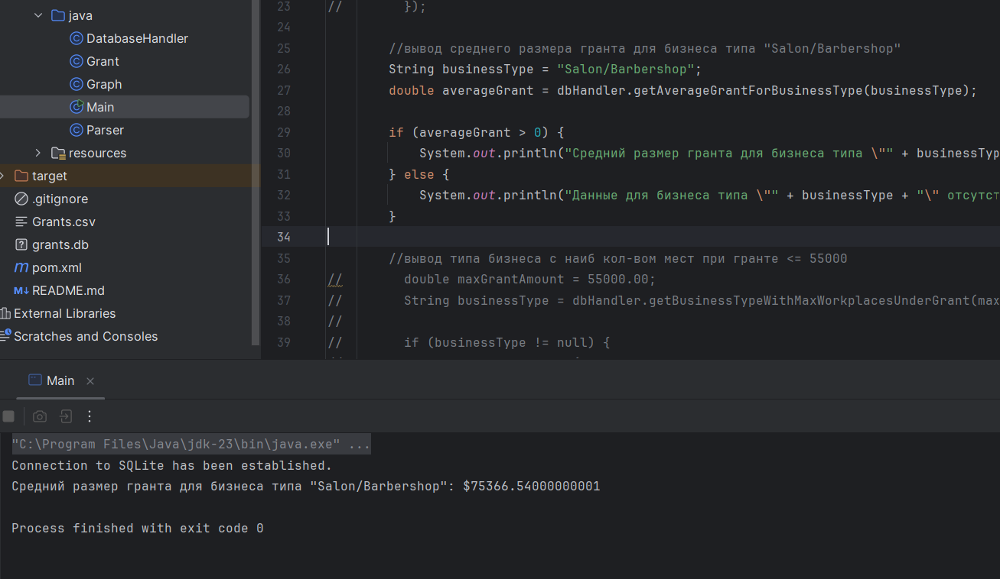
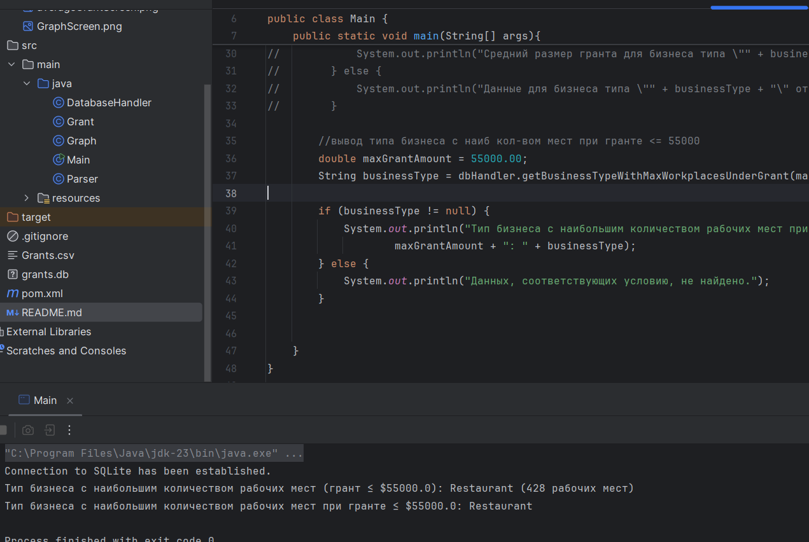

# Итоговый проект по курсу Java
Для начала создал класс Grant

После создал класс Parser, с помощью которого появилась возможность парсить файлы

Создал класс DatabaseHandler для работы с бд

#### Вывод всех данных из бд:

#### 1 задание:

#### 2 задание:
Средний размер гранта для бизнеса типа "Salon/Barbershop": $75366.54

#### 3 задание:
Тип бизнеса с наибольшим количеством рабочих мест (грант ≤ $55000.0): Restaurant (428 рабочих мест)

